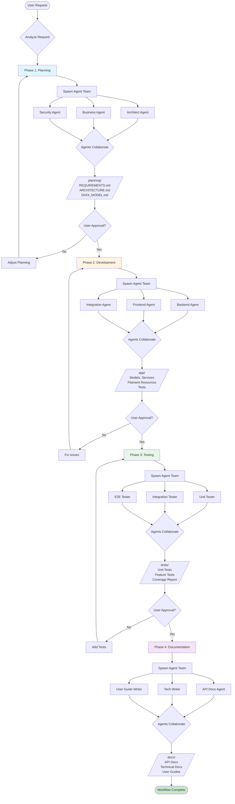
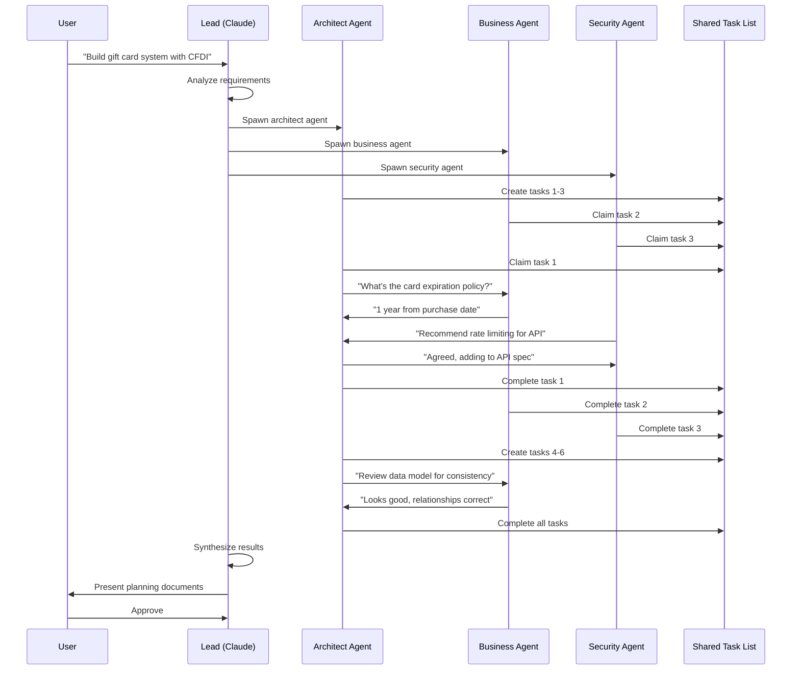
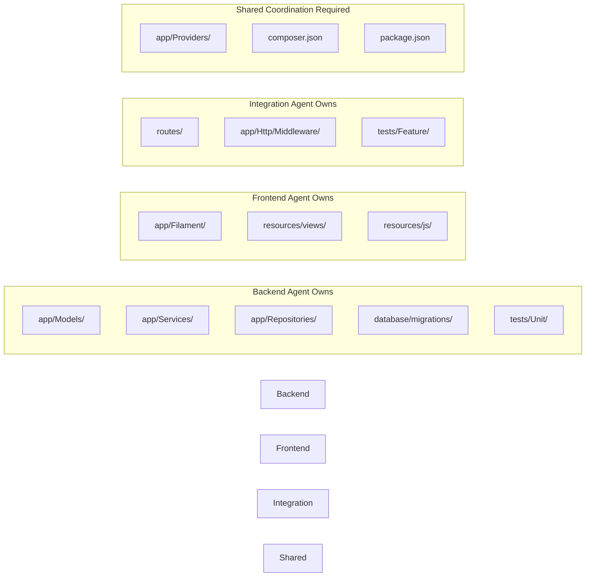
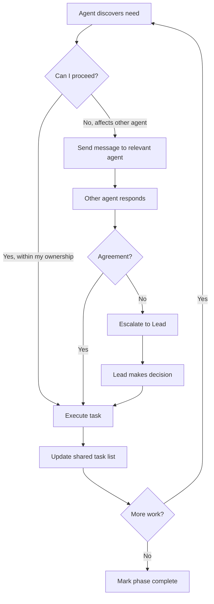
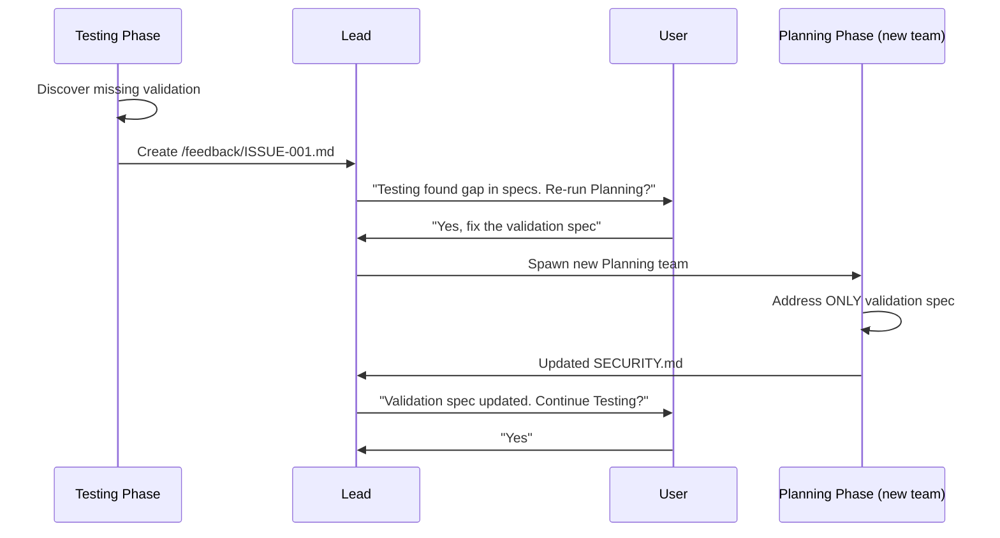
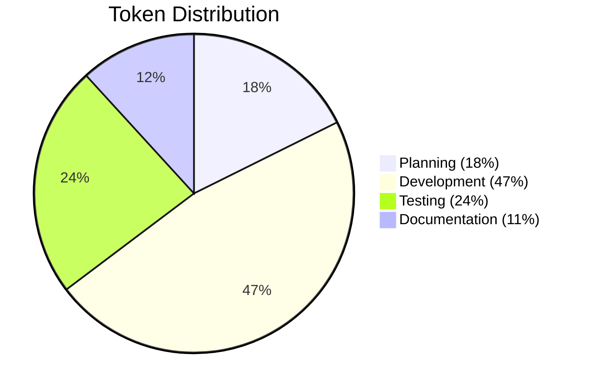

# DevTeam Workflow Diagrams

Visual representations of the DevTeam workflow.

## Complete Workflow Overview

## Phase 1: Planning Team Collaboration

## Phase 2: Development File Ownership

## Agent Communication Pattern

## Cost Optimization Decision Tree

```mermaid
graph TD
    Start([Task to execute]) --> Check{Task type?}
    
    Check -->|Planning/Architecture| High[Use HIGH effort]
    Check -->|Development/Testing| Medium[Use MEDIUM effort]
    Check -->|Documentation| Low[Use LOW effort]
    
    High --> Team1{Team size?}
    Medium --> Team2{Team size?}
    Low --> Team3{Team size?}
    
    Team1 -->|Complex| T3a[3 agents]
    Team1 -->|Simple| T2a[2 agents]
    
    Team2 -->|Complex| T3b[3 agents]
    Team2 -->|Simple| T2b[2 agents]
    
    Team3 -->|Complex| T3c[3 agents]
    Team3 -->|Simple| T2c[2 agents]
    
    T3a --> Estimate1[~150K tokens]
    T2a --> Estimate2[~100K tokens]
    T3b --> Estimate3[~400K tokens]
    T2b --> Estimate4[~270K tokens]
    T3c --> Estimate5[~100K tokens]
    T2c --> Estimate6[~65K tokens]
```

## Feedback Loop Pattern

## Token Usage by Phase (Medium Project)

## Time Distribution (Medium Project)

```mermaid
gantt
    title DevTeam Timeline (Medium Project)
    dateFormat HH:mm
    axisFormat %H:%M
    
    section Phase 1
    Planning Team Spawn    :a1, 00:00, 5m
    Agent Collaboration    :a2, after a1, 30m
    Synthesis & Checkpoint :a3, after a2, 10m
    
    section Phase 2
    Development Team Spawn :b1, after a3, 5m
    Agent Collaboration    :b2, after b1, 60m
    Synthesis & Checkpoint :b3, after b2, 10m
    
    section Phase 3
    Testing Team Spawn     :c1, after b3, 5m
    Agent Collaboration    :c2, after c1, 45m
    Synthesis & Checkpoint :c3, after c2, 10m
    
    section Phase 4
    Docs Team Spawn        :d1, after c3, 5m
    Agent Collaboration    :d2, after d1, 30m
    Final Synthesis        :d3, after d2, 10m
```

---

## How to Use These Diagrams

1. **Copy the mermaid code blocks** to visualize in:
   - GitHub (renders automatically)
   - Mermaid Live Editor: https://mermaid.live
   - VS Code with Mermaid extension
   - Documentation tools (MkDocs, etc.)

2. **Customize for your project:**
   - Adjust agent names
   - Add project-specific phases
   - Modify collaboration patterns

3. **Share with team:**
   - Include in project documentation
   - Use in presentations
   - Reference in CLAUDE.md
